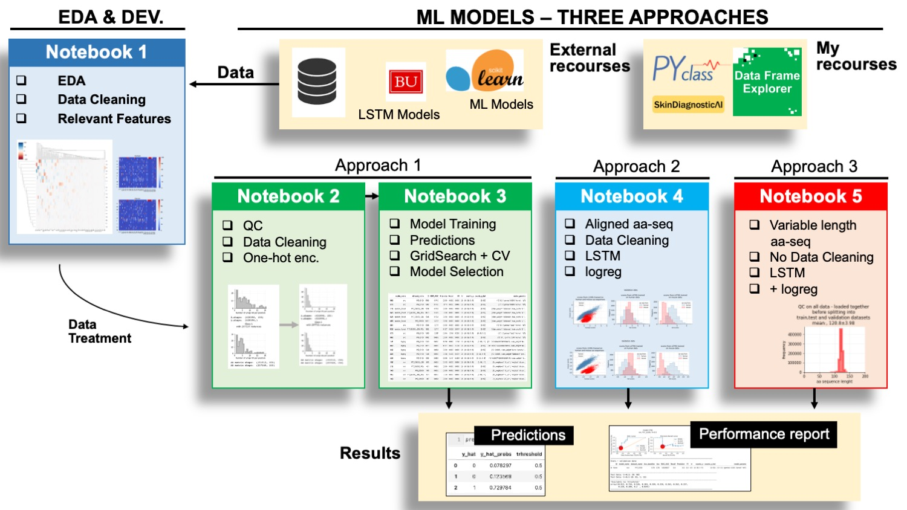
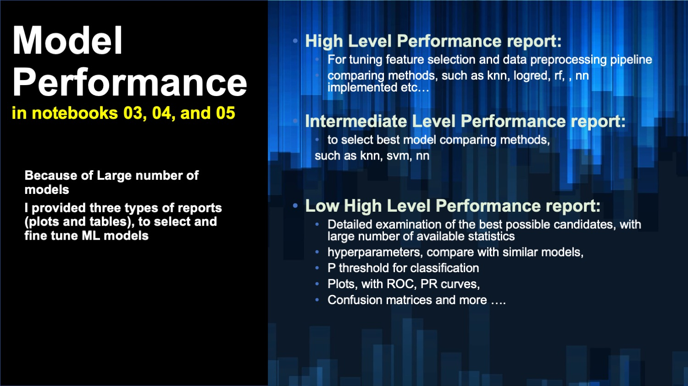
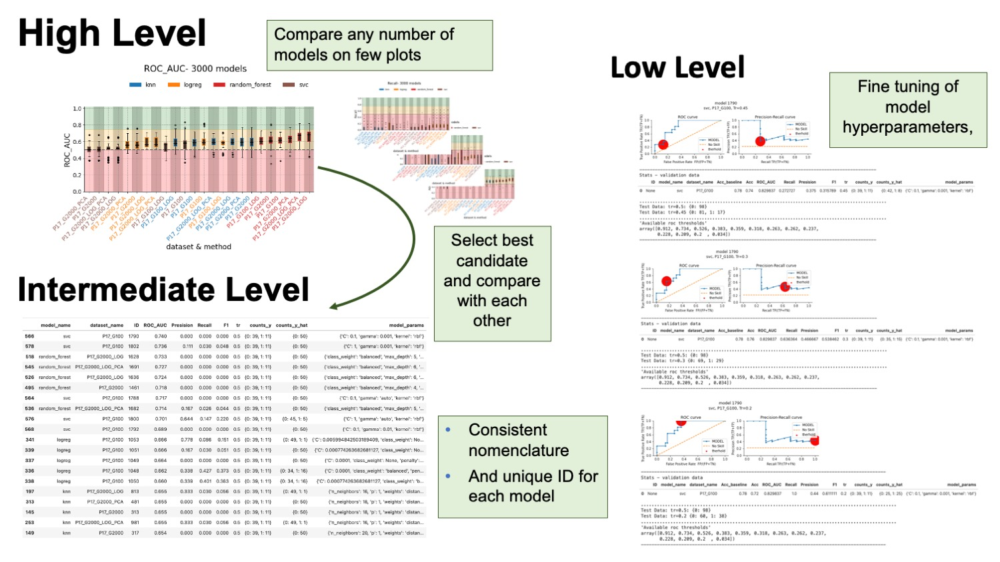
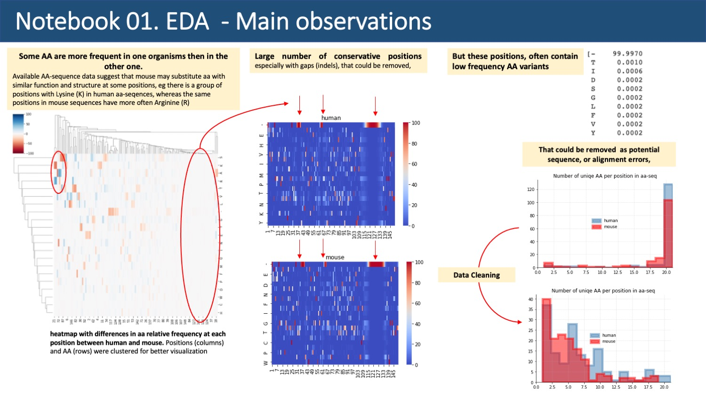
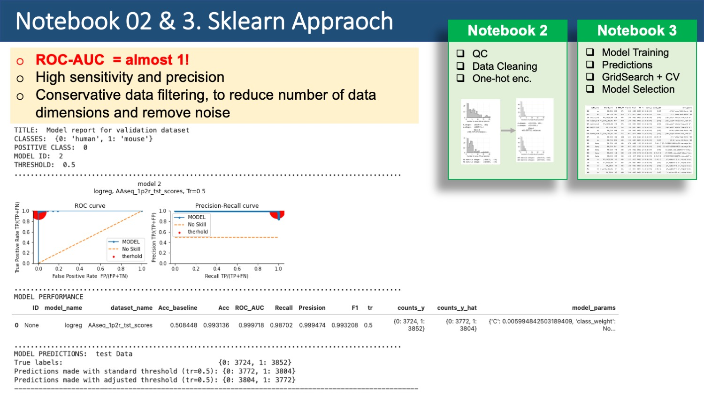
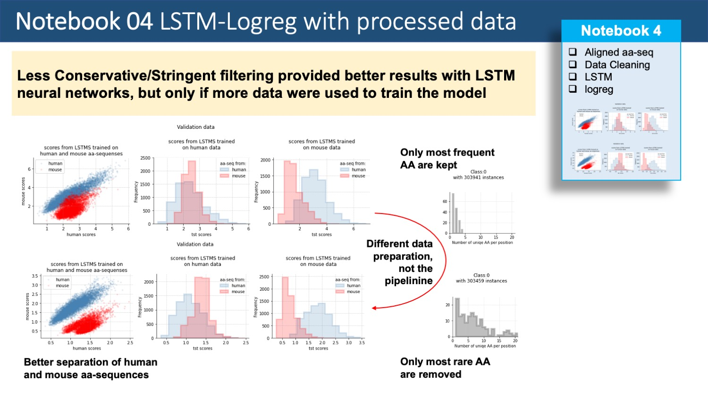
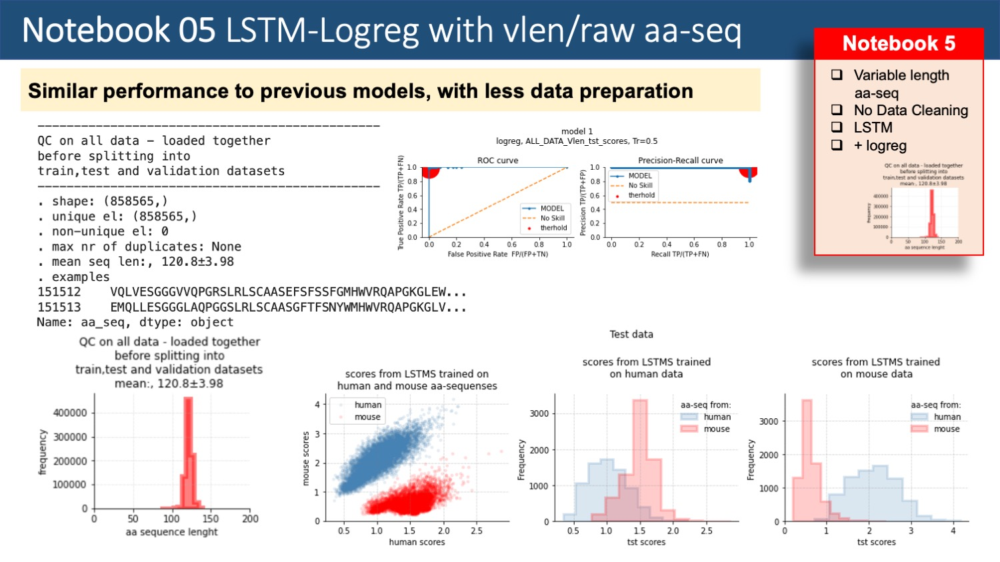

# Antibody_Classificaiton_with_biLSTM
---
Created by __Pawel Rosikiewicz__, __www.SimpleAI.ch__  
Provided with __MIT License__
___

## __ABSTRACT__
__PURPOSE:__ Antibodies are created in animals, such as mouses, horses and chicken. In order to be used therapeutically in humans these proteins should "look like human" anitobodies, ie. they should have similar amino-acid sequence (aa), composition, structure etc... to humna antibodies. Large number of aa-sequences can be obtained from experimental systems with NGS sequencing and used to learn these features. Thus, the goal of this project is to develop machine learning model allowing classyficaiton of new AA-sequences as either human or anial origine (mouse), and scoring their similarity to human antibodies, eg. with probability 0-1.

__MATERIALS & METHODS:__ For this purpose, I used the data, provided Kolahama labolatory that contains over 500.000 AA-sequences from human and similar number of AA-sequences from the mouse that were either aligned to each other, or unaligned and with variable lenght. To develope optimal models, I evaluated several hundred ML models crated with three different approaches.
* (1) I applied stantard sklearn models such as random Forest and Logistic regression, to aligned aa-sequences. the aa-sequences were de-noised, cleaned, and one-hot encoded with my custom pipeline, that allows different level of data cleanign and dimensionality reduction.
* (2) In the second approach, I used the same pipline for data cleaning as in the first aproach, to prepare aligned aa-sequences for LSTM models published by *[Wollacott, Andrew M., et al. 2019](https://academic.oup.com/peds/article/32/7/347/5554642?login=true)*, Subsequently, scores created with two LSTM models, indicating similarity of each new antibody aa-sequence to either mouse or human were used as features in high level classifier (logistic regression), that generated the final score and class assigment. This, apppraoch improved both precision, and sensitivity of predictions in comparison to the models created wiht the first apraoch.
* (3) Finally, I adapted the pipeline used in the second approach, to use unaligned aa-sequences, with variables lenght, and uncleaned data, that generated models with similar accuracy, as the scklear models, using only 10% of the training data.
  

  
__MY WORK__ was divided into 5 different notebooks:
* __Notebook 01__, was used to perform exploratory data analysis on antibody sequences, in order to learn how to clean, and prepare the data, and what ML models could be applied for the task.
* __Notebook 02 amd 03__, were used to implement the first approach with sklearn models. notebook 02, was used to prepare the data for ml models, and notebook 03 was used to train, and evaluate different sklearn classifiers. 
* __Notebook 04__, allows implementaiton of the second appach with LSTMs and high level classifier, Notebook, 04 also allows to test and evaluate different methods for aa-sequence cleaning, and how it may affect LSTM model performance.
* __Notebook 05__, contains the full pipeline for data preparation, QC, LSTM and high level classifier traing and evaluation, wiht unaligned aa-sequences (vlen).
* __src files__; contain all scripts, and tools developed for this project, my peilines called PyClass for medical image classyficaiton with preptrained CNN models, and Python Dataframe Explorer, to allow fast EDA and model summary. Additionally, I copied files provided by Kolahama labolatory to test their model, and implement in my pipeline, after small chnages in the code.  

__PIPELINE IMPLEMENTATION:__ All appraoches (1-3), were evaluated with different data preprocessing procedures, and an extensive hypeparameters search, with custoi pipelines, that generate automated reports, save predictions, and have parametes, such as dataset size, contrlling the number of samples used for trianing, and model selection.

__MODEL PERFORMANCE REPORT__ is generated at the end of each pipeline, for any number of models sorted with ROC-AUC.

## __RESULTS__

### Examploratory Data Analysis

